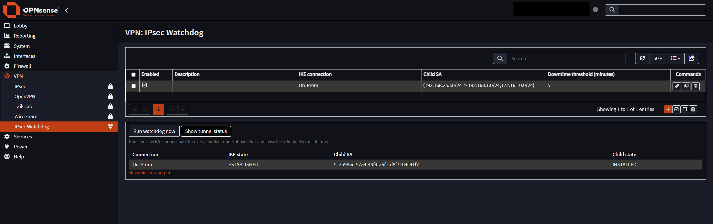

# OPNsense IPsec WatchDog

**Your IPsec tunnels sometimes drop. This notices and reconnects them
automatically, so you don't have to.**



## What is this?

If you run OPNsense and rely on one or more IPsec VPN tunnels — a
site-to-site link to another office, a cloud provider, whatever — you've
probably run into this: a tunnel silently goes down (the remote end
rebooted, an ISP hiccuped, whatever the reason) and it just *stays* down
until a human notices and manually reconnects it.

This plugin does the noticing and reconnecting for you. It adds a page to
OPNsense, **VPN > IPsec Watchdog**, where you list the tunnels you care
about — picked from your existing IPsec setup, not typed by hand — and a
background job checks every one of them once a minute. If a tunnel has been
down longer than the threshold you set for it, the watchdog forces it back
up. No SSH, no remembering to check, no waiting for someone to notice.

That's the whole screenshot above: one tunnel ("On-Prem"), a 5-minute
threshold, and a live status check underneath it (pulled straight from
strongSwan) showing it's currently up — `ESTABLISHED` on the IKE side,
`INSTALLED` on the child SA.

### Why this instead of just checking manually

- **It doesn't rely on you remembering.** That's the entire point — it runs
  unattended, once a minute, forever.
- **Nothing to type or keep in sync.** The connection and child SA dropdowns
  are wired directly into your real **VPN > IPsec > Connections** config.
- **Handles as many tunnels as you have.** One row per tunnel (or per child
  SA, if a tunnel carries more than one) — one background job covers all
  of them, each with its own independent threshold.
- **Still fully visible when you want it.** "Run watchdog now" and "Show
  tunnel status" give you an on-demand check without touching a shell.
- **Tells someone when it can't fix it itself.** If a tunnel is still down
  after several reconnect attempts, an optional webhook call can notify
  wherever you want — see [Notifications
  (optional)](#notifications-optional) below.

### How it actually works, briefly

Every enabled row you add gets checked once a minute by a `configd` action
(`watchdog.php`), which asks strongSwan directly (`swanctl`) whether that
tunnel's child SA is actually up. If it's been down longer than the row's
threshold, it runs `swanctl --initiate` to force it back up. The one-minute
schedule is a normal OPNsense cron job — created for you automatically the
first time you install the package (see [Post-install
configuration](#post-install-configuration) for how to change it).

Built against real OPNsense MVC framework files as reference, then installed
and exercised end-to-end — menu, the tunnel grid, add/edit/delete/toggle,
running the watchdog, the live status table — against a real OPNsense 26.7
box throughout development. Still worth trying on a test box before your
production firewall; every environment's IPsec setup is a little different,
and this hasn't been through a broader public review.

This is a self-hosted/private plugin (built and distributed as a `.pkg`, or
via a small GitHub-hosted repo — see below) — it won't show up in OPNsense's
own **Firmware > Plugins** list, which only lists packages from OPNsense's
*official* repo. More on that trade-off in [Maintainer
notes](docs/maintainer-notes.md#getting-into-the-official-plugin-list-out-of-scope-here),
if it ever matters to you.

## Requirements

- OPNsense (built and tested against 26.7; a FreeBSD 14 build is also
  published for older releases like 25.1–26.1.x — see [Installation](#installation))
- At least one connection already configured under **VPN > IPsec >
  Connections** — this plugin watches existing tunnels, it doesn't create them

## Installation

Two methods, **A** and **B** — not an either/or choice, just two independent
things:

- **A**: get a specific `.pkg` file onto a box and `pkg add` it. Always
  available, any box, any time.
- **B**: point `pkg` at this GitHub repo once, so `pkg install`/`pkg
  upgrade` work from then on.

You can do A today and add B later on the same box, or the other way
around — they don't conflict, and once a version is published to the repo,
`pkg upgrade` works regardless of which method originally installed it.

### Method A — direct install (quickest, no repo config needed)

Good for a single box, or trying it out before setting up the repo config.

1. Get the `.pkg` file onto the box, either:
   - build it there: `git clone` (or `scp`) this repo onto the box, then
     `cd OPNSense-IPSec-WatchDog && sh build.sh` — produces
     `output/<FreeBSD-ABI>/ipsec-watchdog-1.3.pkg`; or
   - build it elsewhere and `scp` just the `.pkg` file over.
2. Install it:
   ```sh
   pkg add ipsec-watchdog-1.3.pkg
   ```
3. Continue at [Post-install configuration](#post-install-configuration) below.

To upgrade later with this method: build the newer version's `.pkg` and run
`pkg add` again (or `pkg delete ipsec-watchdog` first, then `pkg add`).

### Method B — install/upgrade straight from this GitHub repo

This repo's own `gh-pages` branch *is* the pkg repo — nothing separate to
host. `main` holds the source; `gh-pages` holds the built packages and
catalogs.

**One-time, only if GitHub Pages isn't already enabled for this repo:**
Settings > Pages > Source > deploy from the `gh-pages` branch.

**On every OPNsense box you want it on**, point `pkg` at it. Two FreeBSD
bases are published, since OPNsense bumps its base periodically (26.7 runs
FreeBSD 15; older releases like 26.1.x run FreeBSD 14) and a `.pkg` is
tagged for one specific base. Run `pkg config abi` on the box first to see
which you have:

**FreeBSD 15** (current OPNsense, e.g. 26.7+):

```sh
printf '%s\n' \
  'ipsecwatchdog: {' \
  '  url: "https://nerexbcd.github.io/OPNSense-IPSec-WatchDog/",' \
  '  enabled: yes' \
  '}' \
  > /usr/local/etc/pkg/repos/ipsecwatchdog.conf
pkg update
pkg install ipsec-watchdog
```

**FreeBSD 14** (older OPNsense, e.g. 25.1–26.1.x) — same idea, different URL:

```sh
printf '%s\n' \
  'ipsecwatchdog: {' \
  '  url: "https://nerexbcd.github.io/OPNSense-IPSec-WatchDog/freebsd14-amd64/",' \
  '  enabled: yes' \
  '}' \
  > /usr/local/etc/pkg/repos/ipsecwatchdog.conf
pkg update
pkg install ipsec-watchdog
```

(That `printf` instead of a heredoc is deliberate — OPNsense's default root
shell is `csh`, which doesn't understand `<< 'EOF' ... EOF` and just hangs
waiting for input if you paste one in.)

Picking the wrong FreeBSD version fails cleanly at `pkg update` (`wrong
architecture: FreeBSD:15:amd64 instead of FreeBSD:14:amd64` or similar)
rather than installing something broken — if you see that, switch to the
other URL.

Continue at [Post-install configuration](#post-install-configuration) below.

## Post-install configuration

Neither install method does this part for you — it's config, not packaging.

1. **Confirm the menu entry appeared.** **VPN > IPsec Watchdog** should be in
   the left menu. If it isn't yet, restart the web GUI once:
   ```sh
   configctl webgui restart
   ```
2. **Add a tunnel to watch.** On the IPsec Watchdog page, click **+ Add**:
   pick the connection and child SA from the dropdowns (populated from
   **VPN > IPsec > Connections**), set a downtime threshold in minutes, save.
   Repeat for every connection/child SA pair you want watched — a connection
   with more than one child SA just needs one row per child SA, all pointing
   at the same connection.
3. **Sanity check before relying on cron.** Click **Run watchdog now** and
   **Show tunnel status** on the page to confirm it sees your tunnel(s)
   correctly — this is exactly what the screenshot at the top shows.
4. **Nothing to do for cron — it's already scheduled.** Installing the
   package automatically adds a cron job (**System > Settings > Cron**,
   labeled "IPsec Tunnel Watchdog (auto-added, runs every minute)") that
   runs the check/reconnect pass for every tunnel row you've added above,
   every minute. This only happens once, the first time the package is ever
   installed — reinstalling or upgrading later won't create a second one.

   **To change how often it runs:** open that job under System > Settings >
   Cron and edit the **Minute** field (e.g. `*/5` for every 5 minutes) —
   Hour/Day/Month/Weekday work the same way if you want something less
   frequent than "every minute". Whatever you set here survives future
   upgrades of this plugin; it's never reset back to the default. The
   **Command** and **Parameters** fields are locked (OPNsense protects
   auto-registered jobs from being repointed at a different action) — that's
   expected, only the schedule/enabled/description are yours to change.

Check logs any time with:

```sh
grep ipsec-watchdog /var/log/system/latest.log
```

To remove entirely: `pkg delete ipsec-watchdog`. This does **not** remove
the cron job it created (OPNsense won't let a plugin silently delete a
schedule you may have customized) — if you're uninstalling for good, delete
that cron entry yourself from System > Settings > Cron afterwards; once the
package is gone, OPNsense will allow deleting it (it only protects jobs
belonging to a still-installed plugin).

## Notifications (optional)

By default the watchdog just keeps quietly retrying — nothing tells you a
tunnel is having trouble unless you check the page yourself. If you'd rather
be told, the **Notifications** box at the top of the IPsec Watchdog page
sends an HTTP webhook once a tunnel is still down after several reconnect
attempts in a row.

- **Webhook URL**: any HTTP(S) endpoint that accepts a POST — a Slack or
  Discord incoming webhook, PagerDuty, n8n/Zapier, or your own receiver.
  Leave blank to leave notifications off.
- **Notify after this many failed attempts**: consecutive reconnect
  *attempts*, not minutes (default 3) — so with the default 10-minute
  threshold, that's one alert roughly 30 minutes into an outage. Resets
  once the tunnel recovers, so a future outage can alert again.
- **Webhook signing secret** (optional): if set, every request carries an
  `X-Watchdog-Signature: sha256=<hmac>` header (HMAC-SHA256 of the raw
  body) so whatever receives it can verify it really came from this plugin.

Any individual tunnel can also set its own **Webhook URL override** (in its
edit dialog) if you want that one tunnel alerting somewhere different from
everything else — leave it blank to just use the URL above.

It fires once per outage, not every minute forever, and only for "still
stuck down" — there's no separate "recovered" notification, so a resolved
outage is confirmed on the page itself (the live status table), not by a
second webhook. Example payload:

```json
{
  "event": "ipsec_watchdog_still_down",
  "connection": "1925b723-1745-4d53-b2cd-9830050e5542",
  "child": "854b6cb3-9ecb-4379-826a-738042d6852a",
  "description": "On-Prem",
  "attempts": 3,
  "threshold_minutes": 10,
  "timestamp": "2026-09-02T10:26:14+00:00"
}
```

---

Everything below this line is about developing or maintaining the plugin
itself, not using it — skip it unless that's what you're here for.

## What's in here

```
root/usr/local/opnsense/mvc/app/models/OPNsense/IPsecWatchdog/     # model, menu, ACL
root/usr/local/opnsense/mvc/app/controllers/OPNsense/IPsecWatchdog/ # index + API controllers, form def
root/usr/local/opnsense/mvc/app/views/OPNsense/IPsecWatchdog/       # settings page template
root/usr/local/opnsense/scripts/OPNsense/IPsecWatchdog/watchdog.php # the actual check/reconnect logic
root/usr/local/opnsense/scripts/OPNsense/IPsecWatchdog/manage_cron.php # one-time cron job registration on install
root/usr/local/opnsense/service/conf/actions.d/                    # configd action registration
manifest/+MANIFEST   # pkg manifest
plist                # files the package owns
build.sh             # builds the .pkg for every supported FreeBSD base
pkgsite/              # gh-pages install guide template + generator
.github/workflows/    # CI: auto-publish to gh-pages on every GitHub Release
```

## License

BSD 2-Clause, see [LICENSE](LICENSE). See [CHANGELOG.md](CHANGELOG.md) for
release notes.
